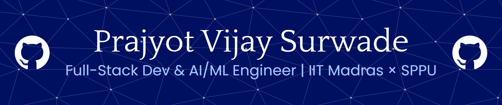

---

[;Full-Stack+Dev+%26+AI%2FML+Engineer+%F0%9F%9A%80;BS+Data+Science+%40+IIT+Madras+%7C+BE+IT+%40+SPPU;Building+LifeLine+%E2%80%94+Blood+%26+Organ+Donor+Finder+%F0%9F%A9%B8;Shipped+ShopAI+%E2%80%94+AI-Powered+E-Commerce+%F0%9F%9B%92;Machine+Learning+%7C+Deep+Learning+%7C+MERN+Stack+%7C+Cloud+%7C+GenAI;Building+Intelligent+Systems+That+Scale+%E2%9A%A1;404%3A+Sleep+not+found+%E2%98%95;It+works+on+my+machine+%F0%9F%98%85)](https://github.com/PrajyotVijay)

---

<h3><i>"Code is poetry. Data is power. I write both."</i></h3>

 

### 💫 About Me

I'm a dual-degree student pursuing **BE in Information Technology** at Savitribai Phule Pune University (SPPU) and **BS in Data Science & Applications** (AI/ML specialization) at **IIT Madras** — building at the intersection of full-stack engineering and intelligent systems.

- 🔭 Currently rebuilding **LifeLine** — Blood & Organ Donor Finder (MERN stack, JWT, MongoDB)
- 🛒 Shipped **ShopAI** — AI-powered e-commerce with fraud detection & recommendations
- ☁️ Completed **AI-Powered Cloud Engineer Virtual Internship** — AICTE × AWS Educate (Jan–Mar 2026)
- 🎓 CGPA: **9.82 / 10** (SPPU, Till Semester 2)
- 🎹 Play harmonium & synthesizer | ✏️ Sketch | 🌌 Astronomy enthusiast | 🏸 Badminton player
- 📍 Pune District, Maharashtra, India

---

### 🧠 Tech Stack

**Languages**

**Frontend**

**Backend**

**Database**

**Cloud & DevOps**

**AI / ML & Data Science**

**CS Fundamentals**

---

### 🚀 Featured Projects

| Project | Description | Stack |
|--------|-------------|-------|
| [🩸LifeLine](https://github.com/PrajyotVijay/lifeline)| Real-time donor discovery platform with geolocation matching, JWT authentication, and emergency requests | MERN, MongoDB, JWT |
| [🛒ShopAI](https://github.com/PrajyotVijay/ShopAI) | AI-powered e-commerce platform with recommendation system, fraud detection, and admin dashboard | Flask, MySQL, Scikit-learn |

---

### 📊 GitHub Stats

---

### 🏅 Certifications & Internships

- ☁️ **AI-Powered Cloud Engineer Virtual Internship** — AICTE × AWS Educate (Jan–Mar 2026, 10 weeks)
- ☁️ **AWS Educate Badges** — Lambda, SageMaker, IAM, Generative AI, Core Cloud Services
- ☁️ **Google Cloud Skill Boost** — Multiple skill badges

---

### 🤝 Connect

---

